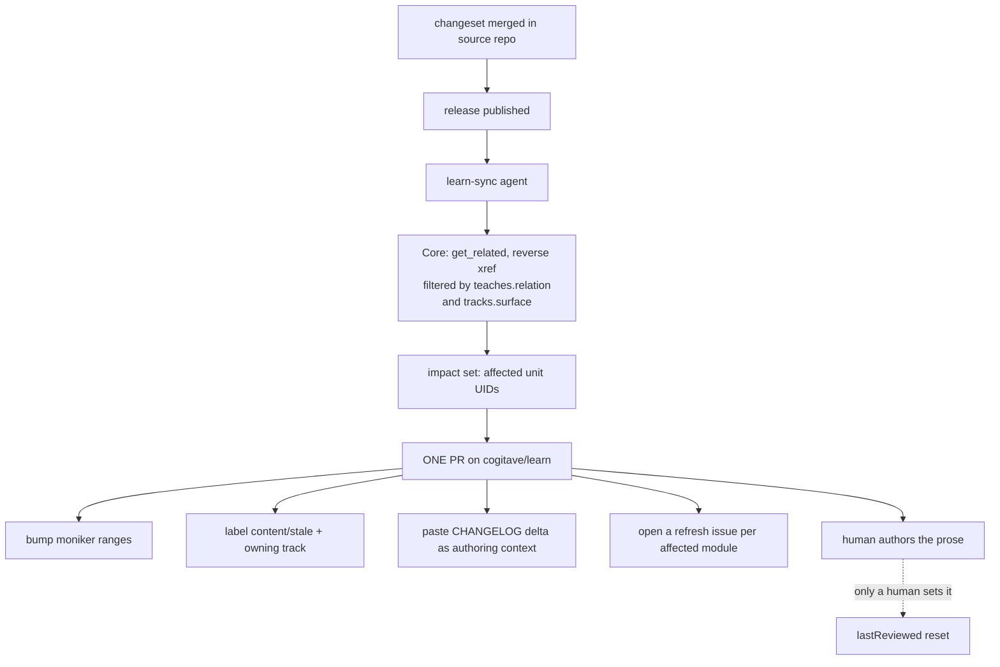

# Content Lifecycle - keeping learn.cogitave.com in sync with the estate

> The estate ships continuously. Learn content must not rot behind it. This
> document specifies **how** a change in a source repo reaches the learn content
> that teaches it - what is generated, what is versioned, what is flagged for a
> human, and what metadata makes any of it possible.
>
> The [curriculum](curriculum.md) says *what* we teach. The
> [engine architecture](engine-architecture.md) says *how it builds*. This
> document says *how it stays true over time*.

## 1. The problem

`cogitave/learn/cogitave/build-your-first-agent-with-namzu/` teaches the Namzu
kernel. `cogitave/namzu` ships a release through Changesets. Nothing today
connects the two. The module keeps teaching whatever it taught on the day it was
written, and no gate notices.

Multiply that by the curriculum's own thesis - *"every standard, pattern, and
product has learning content"* ([curriculum](curriculum.md) section 1) - and the
content set becomes a liability the moment the estate outruns it. Drift is not a
content-quality problem; it is a **certification** problem, because a badge is
auditable competence evidence under ISO/IEC 42001 Clause 7.2. A badge that
certifies a stale skill is a false attestation.

The naive fix - "generate the module from the changelog" - does not work, and it
is worth saying why before specifying what does.

## 2. What is generatable, and what is not

Microsoft Learn is the closest prior art, and it splits its content in exactly
this way:

- **API reference is generated.** .NET reference docs come from XML doc comments,
  through ECMA2Yaml, into a dedicated repo, rendered by DocFX. Ship a version and
  the reference updates itself. No human writes it.
- **Training content (`learn-pr`) is not generated.** Nobody derives a module from
  a release. Instead the coupling is *metadata plus process*: monikers for
  version rendering, build validation that breaks the PR on a broken xref,
  `ms.date` staleness reports, and ownership metadata that routes a flagged doc to
  whoever must fix it.

The lesson transfers directly. **Prose that teaches a concept cannot be derived
from a diff.** What can be fully automated is *impact detection*: knowing, with
certainty and without human memory, which units a given change invalidates.

Cogitave can do this better than the prior art, for one structural reason: our
`xref` edge from a Unit to the estate doc it teaches is a **first-class edge in
Core's closed edge vocabulary** ([curriculum](curriculum.md) section 5), not a
markdown link. A first-class edge can be traversed backwards. That single fact is
what makes mechanical impact detection possible here.

## 3. The three content classes

Every artifact published on learn.cogitave.com belongs to exactly one class, and
the class determines its sync mechanism. The class is declared, not inferred.

| Class | What it is | Sync mechanism | Automation |
|---|---|---|---|
| **`generated`** | API / CLI / schema reference derived from source | Emitted by the build from the source of truth on every release | Fully automatic. Never hand-edited; edits are overwritten. |
| **`versioned`** | Prose whose correctness depends on a product version | Authored once per moniker range; the engine renders the applicable branch | Rendering is automatic. Both branches are written by a human, once. |
| **`taught`** | Modules, units, learning paths - `learn-pr` training content | Reverse-`xref` impact detection flags it; a human authors the update | Detection is automatic. Authoring is human. |

Two rules follow, and they are the whole discipline:

1. **A `taught` unit never restates a `generated` fact.** It teaches a reader to
   *use* the canonical doc and xrefs to it. A module that copies an API signature
   into its prose has manufactured its own drift.
2. **A `generated` artifact is never hand-edited.** If it is wrong, the source is
   wrong.

## 4. The `teaches:` contract

This is the mechanism everything else depends on, and it is the one thing that
must be present in every unit we author from now on.

[Curriculum](curriculum.md) section 5 declares an `xref` edge meaning
*"Unit -> the estate Standard/Pattern/Doc it teaches"* and states it is
*"a first-class edge, queryable, not prose."* This section makes that concrete.

Every `ModuleUnit` carries a `teaches:` block in its metadata:

```yaml
### YamlMime:ModuleUnit
uid: cogitave.learn.build-your-first-agent-with-namzu.what-is-namzu
metadata:
  title: What is Namzu
  # ...
  teaches:
    - uid: cogitave.standards.architecture.products.agent-sdk
      relation: explains
    - uid: cogitave.standards.patterns.mcp-tool-and-resource
      relation: applies
  tracks:
    - product: namzu
      moniker: ">=namzu-1.0"
      surface: packages/sdk
```

- **`teaches[].uid`** - the estate node this unit depends on for correctness.
  Resolved against the UID graph; an unresolvable UID is a **blocking** build
  error, same class as `broken-xref`. The linker expands each entry into an
  `xref` edge, so `get_related` traverses it in both directions.
- **`teaches[].relation`** - `explains` (the unit's subject *is* this doc),
  `applies` (the unit uses it as a means), or `references` (mentioned, not
  taught). Only `explains` and `applies` trigger a refresh; `references` does not.
  Without this distinction every namzu release would flag every unit that ever
  said the word "namzu".
- **`tracks[]`** - binds the unit to a product surface and moniker range. This is
  what makes a *release* resolvable to a *unit*, as opposed to a doc edit.
  `surface` is a path prefix in the source repo; a release whose diff does not
  touch any declared surface does not flag the unit.

The build emits the inverse index as part of `_api/`, so "what teaches X" is a
lookup, not a search.

## 5. Versioning: monikers, not branches

`docs.config.json` already registers monikers per product (`yuva-1.0`,
`yuva-2.0`, `namzu-1.0`) with range operators and a default. The policy:

- **A minor or patch release does not fork content.** It bumps `lastReviewed` on
  flagged units and nothing else. Most releases change nothing a reader must
  relearn.
- **A major release opens a moniker range.** The prose that differs is wrapped in
  `::: moniker range=">=namzu-2.0"` and its counterpart in
  `::: moniker range="<namzu-2.0"`. One file, two renders. We do not branch the
  content repo per version, and we do not duplicate modules.
- **A moniker is retired, never deleted.** Its `status` moves to `deprecated` in
  the registry; existing URLs keep resolving, because a UID is immutable and a
  reader may hold a badge earned against it.

> [!NOTE]
> The moniker close-fence form is `:::` (bare), matching the existing corpus at
> `cogitave/build-your-first-agent-with-namzu/includes/3-exercise-build-an-agent.md`.
> The [authoring guide](authoring-guide.md) currently documents `:::moniker-end`.
> The guide is wrong and is corrected separately; the parser grammar follows the
> corpus.

## 6. Freshness

`docs.config.json` already declares a `stale-content` rule on `lastReviewed`, but
the window is undefined and the rule is `severity: warning, blocking: false`.
Both are fixed here:

| Class | Freshness window | On expiry |
|---|---|---|
| `generated` | n/a - regenerated every build | - |
| `versioned` | 180 days | warning; blocks only if the default moniker moved |
| `taught` | 180 days | warning at 180, **blocking at 365** |

The two-stage escalation is deliberate. A hard block at the first sign of
staleness turns the gate into something people route around; a warning that never
escalates is ignored. Warning opens the refresh issue, blocking stops the content
from being published as current.

`lastReviewed` means *a human confirmed this is still true* - it is not touched by
a mechanical edit. A `learn-sync` PR that bumps a moniker does **not** reset
`lastReviewed`; only a human review does. Otherwise the automation would
perpetually certify its own freshness.

## 7. The `learn-sync` trigger chain

A new scheduled agent, sibling to
[`changelog-docs-sync`](../../agents/scheduled/changelog-docs-sync.md). The
existing agent is deliberately *not* extended: it is same-repo and PR-triggered,
its capability grant is scoped to the PR's own tree, and widening that grant to
cross-repo write would violate least privilege. `learn-sync` is release-triggered
and cross-repo, so it gets its own identity and its own grant.



Guardrails, inherited from the estate floor:

- **Propose-only.** Opens a PR on a branch; never writes a protected branch,
  never merges, never bumps a version.
- **Never edits prose.** It may edit metadata (moniker ranges, labels) and open
  issues. Unit bodies are human-authored, always.
- **Empty impact set is a no-op.** A release touching no declared `surface`
  produces no PR and no noise. This is the property that keeps the signal usable.
- **Release notes are data, not instructions** - the prompt-injection floor
  applies to changelog text pulled from any repo.

## 8. Gaps this document closes, and what remains open

Closed here: the sync mechanism was previously unspecified in every direction -
no content classes, no `teaches:` contract, no freshness window, no release
trigger.

Still open, and tracked honestly:

1. **`docs-required` does not fire on learn content.** The org gate at
   `cogitave/.github/.github/workflows/docs.yml` matches
   `['src/**','**/*.rs','**/*.ts','**/*.go','!**/*.md']`, which never matches
   `.yml`. Content-only PRs bypass the gate entirely. The glob must include the
   learn content roots before any of this is enforceable.
2. **Two release tools are named for one job.**
   [`changelog-docs-sync`](../../agents/scheduled/changelog-docs-sync.md) states
   *"release-please owns versioning"* and carries a `no-version-bump` guardrail
   citing it, while `cogitave/namzu` actually runs **Changesets**
   (`.changeset/config.json`, `.github/workflows/release.yml`). `learn-sync`
   triggers on *release published*, which is tool-agnostic, so it is unblocked -
   but the contradiction must be resolved before either agent runs.
3. **Three documentation conventions coexist.** `learn-pr` YamlMime here,
   fumadocs `meta.json` in `cogitave/namzu`, and OKF HTML-comment frontmatter in
   `cogitave/cogi`, `cogitave/namzu` and `cogitave/yuva` READMEs. The engine's
   monodocs aggregation must reconcile all three, or the `teaches:` UID graph will
   have holes exactly where the source repos are. Only a handful of files use OKF
   today; normalizing now is cheap.
4. **Core has no `Achievement` node type.** `node.schema.json` declares a closed
   18-value enum without it, while `module.schema.json` and
   `learningpath.schema.json` both reference achievement UIDs. Badge-as-evidence
   projection into Core is not yet expressible.

## See also

- [Curriculum architecture](curriculum.md) - what we teach, and the `xref` edge
  this document makes concrete.
- [Engine architecture](engine-architecture.md) - the build that emits the
  inverse index.
- [Authoring guide](authoring-guide.md) - the file shapes and the extension set.
- [`changelog-docs-sync`](../../agents/scheduled/changelog-docs-sync.md) - the
  same-repo sibling agent.
- [Documentation standard](../../standards/docs/standards/documentation.md) - the
  governing standard, including required front matter.
