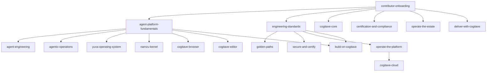

# Curriculum Architecture - learn.cogitave.com

> The single canonical map of what learn.cogitave.com teaches and how it is ordered. This document is the curriculum; the individual `index.yml` path and module files are its projection. It builds on the existing scaffold (the `agent-platform-fundamentals` path plus the `build-your-first-agent-with-namzu` and `understand-yuva` modules) and follows the MicrosoftDocs/learn-pr convention exactly, as codified in the [authoring guide](authoring-guide.md) and served by the [engine](engine-architecture.md).

## 1. The curriculum thesis

**learn.cogitave.com teaches how to build and run an AI-native, certification-grade organization.** The reader - mostly an organization adopting the approach, and individual learners - learns the transferable patterns and builds their own org's version of each. Cogitave's own estate, one harmonic vertically integrated model around a single canonical Core, is the worked reference throughout: every standard, pattern, product spec, compliance control, and operational agent has a place a person can learn it, in the order that makes it stick. The products (Yuva, Namzu, Massar, Diyar) are things the reader adopts; the estate and Core structure is a pattern the reader replicates, shown through Cogitave's instance.

Three commitments follow from that thesis:

1. **Every standard, pattern, and product has learning content.** The estate is the syllabus. A module does not paraphrase a doc - it teaches a reader to *use* the canonical doc, and links to it as the source of truth. When the estate grows, the curriculum grows; a doc with no path that teaches it is a gap the roadmap tracks (see [section 6](#6-authoring-roadmap)).
2. **Humans learn the same model agents query.** An agent calls `describe_schema` and `get_learning_path` to plan work over the estate; a human walks a `LearningPath` of the same UID-linked nodes. Learn content projects into Core as `LearningPath`/`Module`/`Unit`/`Skill` nodes ([section 5](#5-mcp-queryable-the-learning-graph)), so the curriculum is not a separate product - it is one more projection of the one model.
3. **The curriculum is backward-designed from competencies.** A completed `Module` awards a badge; a completed `LearningPath` awards a trophy. Under the AIMS (ISO/IEC 42001 Clause 7.2, [iso-42001-crosswalk](../../compliance/docs/iso-42001-crosswalk.md)) and [training-and-competence](../../corp/people/competence/training-and-competence.md), a badge is auditable evidence that a person holds a `Skill`. So each module is designed Skill-first: name the competency, write the knowledge check that proves it, then author the units that get the reader there.

> [!NOTE]
> The format is the standard; the engine is ours. Nothing in this curriculum requires an engine or schema change - a track is only new `.yml`/`.md` files in the shapes the [authoring guide](authoring-guide.md) already defines, plus new entries in [`achievements.yml`](../achievements.yml).

## 2. The track map

The estate is large enough to need a tiered curriculum, not a flat list. It is organized as **Tier-0 foundation** plus three track families - **role**, **product**, and **topic** - the same three axes Microsoft Learn organizes around (a path is either role-based or technology-based; a topic path teaches a cross-cutting subject). A single module can appear in more than one path (it is referenced by UID, never copied), so `understand-yuva` serves both the platform-fundamentals path and the Yuva product track.

Each path below is a table of its ordered modules. The **Prereq** column is the intra-path ordering (a module builds on the one above it); the **path** prerequisite is stated in the path heading. The **Teaches (estate docs)** column is the set of canonical docs each module teaches - a first-class `xref`/`teachesSkill` edge in the graph ([section 5](#5-mcp-queryable-the-learning-graph)), not prose.

### 2.0 Tier-0 foundation

Every role track depends on Tier-0. It is the entry point for a new human or agent contributor.

#### Path `cogitave.learn.paths.contributor-onboarding` (trophy) - prereq: none

| # | Module (`cogitave.learn.<slug>`) | Prereq | Teaches (estate docs) |
|---|---|---|---|
| 1 | `apply-the-agents-floor` *(exists)* | - | root [AGENTS.md](../../../AGENTS.md) 7 rules; [commits-versioning](../../standards/docs/standards/commits-versioning.md); [documentation](../../standards/docs/standards/documentation.md); [authorization](../../standards/docs/standards/authorization.md); [autonomy-and-oversight](../../standards/docs/standards/autonomy-and-oversight.md) |
| 2 | `inherit-the-project-baseline` *(exists)* | 1 | [project-baseline](../../standards/docs/standards/project-baseline.md); [product-core-baseline](../../standards/docs/standards/product-core-baseline.md); [patterns/README](../../standards/docs/patterns/README.md) |
| 3 | `work-the-request-lifecycle` *(exists)* | 2 | [lifecycle/LIFECYCLE](../../agents/lifecycle/LIFECYCLE.md); [definition-of-done](../../agents/lifecycle/definition-of-done.md) |
| 4 | `open-your-first-pull-request` *(exists)* | 3 | [commits-versioning](../../standards/docs/standards/commits-versioning.md); [hooks-precommit](../../standards/docs/standards/hooks-precommit.md); [documentation](../../standards/docs/standards/documentation.md) |

#### Path `cogitave.learn.paths.agent-platform-fundamentals` (trophy) - prereq: contributor-onboarding

Start where a reader can build (Namzu on Node), then step down a layer to the sovereign kernel it will eventually run on. The prerequisite is now stated as contributor-onboarding.

| # | Module | Prereq | Teaches (estate docs) |
|---|---|---|---|
| 1 | `build-your-first-agent-with-namzu` *(exists)* | - | [products/agent-sdk](../../standards/docs/architecture/products/agent-sdk.md); [ai-agent-engineering](../../standards/docs/standards/ai-agent-engineering.md); [mcp-tool-and-resource](../../standards/docs/patterns/mcp-tool-and-resource.md) |
| 2 | `understand-yuva` *(exists)* | 1 | [products/os](../../standards/docs/architecture/products/os.md); [ADR-0010 no-single-product-runtime-core](../../standards/docs/decisions/0010-no-single-product-runtime-core.md) |

### 2.1 Role tracks

What a person in a role needs, end to end. Each depends on Tier-0.

#### Path `cogitave.learn.paths.build-on-cogitave` (trophy) - role: developer; prereq: agent-platform-fundamentals + engineering-standards

| # | Module | Prereq | Teaches (estate docs) |
|---|---|---|---|
| 1 | `scaffold-a-service-from-the-baseline` | - | [project-baseline](../../standards/docs/standards/project-baseline.md); [product-core-baseline](../../standards/docs/standards/product-core-baseline.md); [service-scaffold](../../standards/docs/patterns/service-scaffold.md) |
| 2 | `apply-the-golden-paths` | 1 | [patterns/README](../../standards/docs/patterns/README.md); [api-endpoint](../../standards/docs/patterns/api-endpoint.md); [data-access-and-migrations](../../standards/docs/patterns/data-access-and-migrations.md); [error-handling](../../standards/docs/patterns/error-handling.md) |
| 3 | `test-and-ship` | 2 | [testing-quality](../../standards/docs/standards/testing-quality.md); [ci-cd-pipelines](../../standards/docs/standards/ci-cd-pipelines.md); [deployment-and-delivery](../../standards/docs/standards/deployment-and-delivery.md); [branching-release](../../standards/docs/standards/branching-release.md) |
| 4 | `instrument-for-observability` | 3 | [observability](../../standards/docs/standards/observability.md); [observability-instrumentation](../../standards/docs/patterns/observability-instrumentation.md) |

#### Path `cogitave.learn.paths.operate-the-platform` (trophy) - role: platform / SRE; prereq: engineering-standards

| # | Module | Prereq | Teaches (estate docs) |
|---|---|---|---|
| 1 | `provision-the-landing-zone` | - | [infra/docs](../../infra/docs/); [infrastructure-selection](../../standards/docs/standards/infrastructure-selection.md) |
| 2 | `run-reliability-and-slos` | 1 | [reliability](../../standards/docs/standards/reliability.md) |
| 3 | `observe-the-estate` | 2 | [observability](../../standards/docs/standards/observability.md); [infra/observability](../../infra/observability/) |
| 4 | `respond-to-incidents` | 3 | [ops/README](../../ops/README.md) (incident-response + business-continuity) |

#### Path `cogitave.learn.paths.secure-and-certify` (trophy) - role: security / compliance; prereq: engineering-standards

| # | Module | Prereq | Teaches (estate docs) |
|---|---|---|---|
| 1 | `threat-model-and-secure-sdlc` | - | [security](../../standards/docs/standards/security.md); [secure-development-lifecycle](../../standards/docs/standards/secure-development-lifecycle.md) |
| 2 | `identity-authz-and-least-privilege` | 1 | [authorization](../../standards/docs/standards/authorization.md); [identity-sso](../../standards/docs/standards/identity-sso.md); [pki-and-oauth](../../standards/docs/standards/pki-and-oauth.md) |
| 3 | `manage-secrets-and-supply-chain` | 2 | [secrets-and-env](../../standards/docs/standards/secrets-and-env.md); [supply-chain](../../standards/docs/standards/supply-chain.md); [ADR-0008 secrets-management](../../standards/docs/decisions/0008-secrets-management-and-dotenvx.md) |
| 4 | `evidence-and-the-certification-spine` | 3 | [compliance/README](../../compliance/README.md); [iso-42001-crosswalk](../../compliance/docs/iso-42001-crosswalk.md); [soa](../../compliance/docs/soa.md); [ssp](../../compliance/docs/ssp.md); [ADR-0005 certification-spine](../../standards/docs/decisions/0005-certification-spine.md) |

#### Path `cogitave.learn.paths.agent-engineering` (trophy) - role: agent-builder; prereq: agent-platform-fundamentals

| # | Module | Prereq | Teaches (estate docs) |
|---|---|---|---|
| 1 | `design-agent-identity-and-capabilities` | - | [agent-identity-and-capabilities](../../agents/identity/agent-identity-and-capabilities.md) (+ `capability-schema.json`) |
| 2 | `build-mcp-tools-and-resources` | 1 | [mcp-tool-and-resource](../../standards/docs/patterns/mcp-tool-and-resource.md); [ai-agent-engineering](../../standards/docs/standards/ai-agent-engineering.md) |
| 3 | `select-a-model` | 2 | model-selection decision guide *(content prerequisite - not yet authored; see [section 6](#6-authoring-roadmap))*; [ADR-0021 technology-selection-guidance](../../standards/docs/decisions/0021-technology-selection-guidance.md) |
| 4 | `evaluate-and-red-team` | 3 | [eval-harness](../../agents/evals/eval-harness.md) |
| 5 | `ground-agents-with-rag` | 4 | [rag-architecture](../../standards/docs/standards/rag-architecture.md); [ml-engineering](../../standards/docs/standards/ml-engineering.md) |

#### Path `cogitave.learn.paths.deliver-with-cogitave` (trophy) - role: consultant / alliances; prereq: contributor-onboarding

| # | Module | Prereq | Teaches (estate docs) |
|---|---|---|---|
| 1 | `the-cogitave-delivery-model` | - | [corp/services](../../corp/services/); [company/business-model](../../corp/company/business-model.md) |
| 2 | `run-an-alliance-engagement` | 1 | [corp/alliances](../../corp/alliances/) |
| 3 | `position-and-go-to-market` | 2 | [corp/gtm](../../corp/gtm/); [corp/marketing](../../corp/marketing/) |

### 2.2 Product tracks

One track per product surface. Each teaches a product spec plus the ADRs that shaped it.

#### Path `cogitave.learn.paths.yuva-operating-system` (trophy) - product: yuva; prereq: agent-platform-fundamentals

| # | Module | Prereq | Teaches (estate docs) |
|---|---|---|---|
| 1 | `understand-yuva` *(reused)* | - | [products/os](../../standards/docs/architecture/products/os.md) |
| 2 | `yuva-capability-os-and-sandboxing` | 1 | [products/os](../../standards/docs/architecture/products/os.md); [products ADR-0004 yuva-capability-os](../../standards/docs/architecture/products/decisions/0004-yuva-capability-os-self-hostable.md); [authorization](../../standards/docs/standards/authorization.md) |
| 3 | `run-and-schedule-agents-on-yuva` | 2 | [agents/scheduled](../../agents/scheduled/); [agents/operations/README](../../agents/operations/README.md) |

#### Path `cogitave.learn.paths.namzu-kernel` (trophy) - product: namzu; prereq: agent-platform-fundamentals

| # | Module | Prereq | Teaches (estate docs) |
|---|---|---|---|
| 1 | `build-your-first-agent-with-namzu` *(reused)* | - | [products/agent-sdk](../../standards/docs/architecture/products/agent-sdk.md) |
| 2 | `namzu-is-the-sdk` | 1 | [products ADR-0003 namzu-kernel-is-the-sdk](../../standards/docs/architecture/products/decisions/0003-namzu-kernel-is-the-sdk.md); [ai-agent-engineering](../../standards/docs/standards/ai-agent-engineering.md) |

#### Path `cogitave.learn.paths.cogitave-core` (trophy) - product: core; prereq: contributor-onboarding

| # | Module | Prereq | Teaches (estate docs) |
|---|---|---|---|
| 1 | `the-property-graph-substrate` | - | [core/architecture](../../core/docs/architecture.md); [core/substrate](../../core/docs/substrate.md); [core ADR-0001 property-graph-substrate](../../core/docs/decisions/0001-property-graph-as-substrate.md) |
| 2 | `query-the-estate-over-mcp` | 1 | [core/mcp-interface](../../core/docs/mcp-interface.md); [core/query](../../core/docs/query.md); [core ADR-0003 mcp-native](../../core/docs/decisions/0003-mcp-native.md) |
| 3 | `hybrid-retrieval-and-incremental-build` | 2 | [core ADR-0002 hybrid-retrieval](../../core/docs/decisions/0002-hybrid-retrieval.md); [core ADR-0004 content-addressed-incremental](../../core/docs/decisions/0004-content-addressed-incremental.md) |

#### Path `cogitave.learn.paths.cogitave-browser` (trophy) - product: browser; prereq: agent-platform-fundamentals

| # | Module | Prereq | Teaches (estate docs) |
|---|---|---|---|
| 1 | `the-agent-native-browser` | - | [products/browser](../../standards/docs/architecture/products/browser.md); [products ADR-0001 browser-engine-and-agent-native](../../standards/docs/architecture/products/decisions/0001-browser-engine-and-agent-native.md) |

#### Path `cogitave.learn.paths.cogitave-editor` (trophy) - product: editor; prereq: agent-platform-fundamentals

| # | Module | Prereq | Teaches (estate docs) |
|---|---|---|---|
| 1 | `the-native-editor` | - | [products/editor](../../standards/docs/architecture/products/editor.md); [products ADR-0002 editor-native-rust-not-a-fork](../../standards/docs/architecture/products/decisions/0002-editor-native-rust-not-a-fork.md) |

#### Path `cogitave.learn.paths.cogitave-cloud` (trophy) - product: cogitave-cloud; prereq: operate-the-platform

| # | Module | Prereq | Teaches (estate docs) |
|---|---|---|---|
| 1 | `the-cogitave-cloud-platform` | - | [products/cloud](../../standards/docs/architecture/products/cloud.md); [saas](../../standards/docs/standards/saas.md); [multi-tenancy](../../standards/docs/patterns/multi-tenancy.md) |
| 2 | `the-ai-ecosystem-and-registry` | 1 | [products/ai-ecosystem](../../standards/docs/architecture/products/ai-ecosystem.md); [products ADR-0005 ecosystem-plugin-auth-and-registry](../../standards/docs/architecture/products/decisions/0005-ecosystem-plugin-auth-and-registry.md) |

### 2.3 Topic tracks

Cross-cutting subjects a reader can pursue independent of role or product.

#### Path `cogitave.learn.paths.engineering-standards` (trophy) - subject: engineering; prereq: contributor-onboarding

| # | Module | Prereq | Teaches (estate docs) |
|---|---|---|---|
| 1 | `how-cogitave-builds` | - | [ai-native-development](../../standards/docs/standards/ai-native-development.md); [ADR-0003 build-from-scratch](../../standards/docs/decisions/0003-build-from-scratch-reference-not-dependency.md); [ADR-0013 reuse-first](../../standards/docs/decisions/0013-reuse-first-convergent-ai-development.md) |
| 2 | `code-and-api-standards` | 1 | [naming](../../standards/docs/standards/naming.md); [api-design](../../standards/docs/standards/api-design.md); [api-versioning-and-deprecation](../../standards/docs/standards/api-versioning-and-deprecation.md); [configuration](../../standards/docs/standards/configuration.md) |
| 3 | `quality-and-delivery-standards` | 2 | [testing-quality](../../standards/docs/standards/testing-quality.md); [test-harness](../../standards/docs/standards/test-harness.md); [ci-cd-pipelines](../../standards/docs/standards/ci-cd-pipelines.md); [deployment-and-delivery](../../standards/docs/standards/deployment-and-delivery.md) |
| 4 | `document-and-diagram-as-code` | 3 | [documentation](../../standards/docs/standards/documentation.md); [diagrams](../../standards/docs/standards/diagrams.md); [ADR-0004 docs-engine-docfx-spec](../../standards/docs/decisions/0004-docs-engine-docfx-spec.md) |

#### Path `cogitave.learn.paths.golden-paths` (trophy) - subject: patterns; prereq: engineering-standards

| # | Module | Prereq | Teaches (estate docs) |
|---|---|---|---|
| 1 | `discover-before-you-build` | - | [patterns/README](../../standards/docs/patterns/README.md); [patterns/catalog.yaml](../../standards/docs/patterns/catalog.yaml); [ADR-0022 patterns-catalog-and-project-inheritance](../../standards/docs/decisions/0022-patterns-catalog-and-project-inheritance.md) |
| 2 | `service-and-api-patterns` | 1 | [service-scaffold](../../standards/docs/patterns/service-scaffold.md); [api-endpoint](../../standards/docs/patterns/api-endpoint.md); [background-jobs](../../standards/docs/patterns/background-jobs.md); [events-and-messaging](../../standards/docs/patterns/events-and-messaging.md) |
| 3 | `data-and-integration-patterns` | 2 | [data-access-and-migrations](../../standards/docs/patterns/data-access-and-migrations.md); [caching](../../standards/docs/patterns/caching.md); [external-integration](../../standards/docs/patterns/external-integration.md); [multi-tenancy](../../standards/docs/patterns/multi-tenancy.md) |
| 4 | `frontend-and-config-patterns` | 3 | [frontend-component](../../standards/docs/patterns/frontend-component.md); [feature-flags](../../standards/docs/patterns/feature-flags.md); [configuration](../../standards/docs/patterns/configuration.md) |

#### Path `cogitave.learn.paths.agentic-operations` (trophy) - subject: agentic-operations; prereq: agent-platform-fundamentals

| # | Module | Prereq | Teaches (estate docs) |
|---|---|---|---|
| 1 | `what-is-agentic-operations` | - | [agentic-operations](../../standards/docs/standards/agentic-operations.md) |
| 2 | `the-scheduled-agent-fleet` | 1 | [agents/scheduled](../../agents/scheduled/) (pr-triage, dependency-review, issue-grooming, changelog-docs-sync, security-triage) |
| 3 | `operations-agents-in-the-business` | 2 | [agents/operations](../../agents/operations/) (community-support, content-marketing, finops-anomaly, revops-lead, seo-geo, status-comms) |

#### Path `cogitave.learn.paths.certification-and-compliance` (trophy) - subject: compliance; prereq: contributor-onboarding

| # | Module | Prereq | Teaches (estate docs) |
|---|---|---|---|
| 1 | `the-certification-spine` | - | [ADR-0005 certification-spine](../../standards/docs/decisions/0005-certification-spine.md); [compliance/README](../../compliance/README.md) |
| 2 | `the-aims-and-iso-42001` | 1 | [iso-42001-crosswalk](../../compliance/docs/iso-42001-crosswalk.md); [ai-management-policy](../../compliance/docs/ai-management-policy.md) |
| 3 | `controls-as-code-and-oscal` | 2 | [compliance/oscal](../../compliance/oscal/); [control-crosswalk](../../compliance/docs/control-crosswalk.md); [compliance ADR-0001 controls-as-code](../../compliance/docs/decisions/0001-controls-as-code.md) |
| 4 | `risk-privacy-and-trust` | 3 | [compliance/risk](../../compliance/risk/); [compliance/privacy](../../compliance/privacy/); [compliance/trust](../../compliance/trust/); [compliance/vendor-risk](../../compliance/vendor-risk/) |

#### Path `cogitave.learn.paths.operate-the-estate` (trophy) - subject: operate-the-estate; prereq: contributor-onboarding

| # | Module | Prereq | Teaches (estate docs) |
|---|---|---|---|
| 1 | `the-estate-as-org-as-code` | - | [ADR-0002 single-org-multi-tier](../../standards/docs/decisions/0002-single-org-multi-tier-estate.md); [ADR-0006 mirror-principle](../../standards/docs/decisions/0006-mirror-principle-estate-manifest.md); [bootstrap/estate.yaml](../../bootstrap/estate.yaml); [estate-taxonomy](../../standards/docs/standards/estate-taxonomy.md) |
| 2 | `decision-guides-selecting-technology` | 1 | [database-selection](../../standards/docs/standards/database-selection.md); [infrastructure-selection](../../standards/docs/standards/infrastructure-selection.md); [ADR-0021 technology-selection-guidance](../../standards/docs/decisions/0021-technology-selection-guidance.md); model-selection guide *(pending - [section 6](#6-authoring-roadmap))* |
| 3 | `the-request-lifecycle-in-depth` | 2 | [lifecycle/LIFECYCLE](../../agents/lifecycle/LIFECYCLE.md); [core/mcp-interface](../../core/docs/mcp-interface.md) request-lifecycle tools |

## 3. The prerequisite graph

The foundational paths form a directed acyclic graph. `dependsOn` edges (see [section 5](#5-mcp-queryable-the-learning-graph)) order them: contributor-onboarding is the single root every track reaches back to; engineering-standards and agent-platform-fundamentals are the two second-tier hubs the role and product tracks build on. Topic tracks that only require estate literacy attach directly to onboarding.



> [!TIP]
> The same edges drive `get_learning_path`: given a `targetSkill` and the reader's `knownSkills`, the engine walks `dependsOn` backward to emit only the modules the reader has not yet earned, in prerequisite order. The graph above is the human-readable form of that traversal.

## 4. The learn-pr authoring model

A path is authored as files in the shapes the [authoring guide](authoring-guide.md) fixes. Nothing here deviates from the existing scaffold; the convention is followed exactly.

**Hierarchy: LearningPath -> Module -> Unit, linked by UID (not physical nesting).**

- A **LearningPath** (`### YamlMime:LearningPath`, uid `cogitave.learn.paths.<slug>`) has a `metadata` block, top-level `title`/`summary`/`prerequisites`/`iconUrl`/`levels`/`roles`/`products`/`subjects`, an ordered `modules:` list of Module UIDs, and a `trophy:` UID. Path completion awards the **trophy**.
- A **Module** (`### YamlMime:Module`, uid `cogitave.learn.<slug>`) has `metadata`, `summary`, an `abstract` that opens "By the end of this module you'll be able to:", `prerequisites`, taxonomy fields, an ordered `units:` list of Unit UIDs, and a `badge:` UID. Module completion (all units, including the one knowledge check) awards the **badge**.
- A **ModuleUnit** (`### YamlMime:ModuleUnit`, uid `cogitave.learn.<module>.<unit>`) has `metadata`, `durationInMinutes`, and a `content:` that is almost always a single include; prose lives in `includes/N-<unit>.md`, never inline.
- A **knowledge-check** unit adds `module_assessment: true` to its metadata and a `quiz:` with `questions` -> `choices` where each choice has `isCorrect` and `explanation` (>= 2 choices, exactly 1 correct in single-answer mode - a blocking gate).
- Every badge and trophy is declared in [`achievements.yml`](../achievements.yml) (`### YamlMime:Achievements`); an unresolved `badge`/`trophy` fails the build.

**Skill-first (backward) design.** Author a module in this order: (1) name the `Skill` it certifies; (2) write the knowledge-check questions that prove the Skill; (3) author the units that get the reader to pass them. The badge is then genuine competence evidence, not a completion sticker.

### Scaffold example - a new LearningPath

The onboarding path, in the exact shape of the existing `agent-platform-fundamentals/index.yml`:

```yaml
### YamlMime:LearningPath
uid: cogitave.learn.paths.contributor-onboarding
metadata:
  title: Contributor onboarding
  description: Start here. Learn who Cogitave is, how the estate is laid out, the non-negotiable engineering floor, and how to work a request end to end.
  ms.date: 2026-07-02
  author: cogitave
  ms.topic: learning-path
title: Contributor onboarding
summary: |
  The entry point for every contributor, human or agent. Learn who Cogitave is, navigate the mirrored estate, internalize the non-negotiable floor, and work your first request through the lifecycle.
prerequisites: |
  - None. This is the first path.
iconUrl: /learn/achievements/contributor-onboarding.svg
levels:
  - beginner
roles:
  - developer
  - content-developer
products:
  - cogitave-core
subjects:
  - it-management
modules:
  - cogitave.learn.apply-the-agents-floor
  - cogitave.learn.inherit-the-project-baseline
  - cogitave.learn.work-the-request-lifecycle
  - cogitave.learn.open-your-first-pull-request
trophy:
  uid: cogitave.learn.paths.contributor-onboarding.trophy
```

### Scaffold example - a new Module

```yaml
### YamlMime:Module
uid: cogitave.learn.apply-the-agents-floor
metadata:
  title: Apply the AGENTS floor
  description: State the seven non-negotiable rules every Cogitave contributor and agent obeys, say what enforces each one, and apply them to your own first change.
  ms.date: 2026-07-26
  author: cogitave
  ms.topic: module
title: Apply the AGENTS floor
summary: State the seven non-negotiable rules every Cogitave contributor and agent obeys, say what enforces each one - a hook, a CI gate, an org ruleset, or policy-as-code - and apply them to your own first change.
abstract: |
  By the end of this module, you'll be able to:
  - Name the seven non-negotiable rules in the root AGENTS.md and explain why they are the floor.
  - Say what enforces each rule - a commit-msg hook, a CI gate, an org ruleset, or policy-as-code.
  - Apply the floor to your own first change: sign it, name it as a Conventional Commit, update its docs, and stay inside your grant.
prerequisites: |
  - None. This is the first module of contributor onboarding.
iconUrl: /learn/achievements/apply-the-agents-floor.svg
ratingEnabled: true
levels:
  - beginner
roles:
  - developer
products:
  - cogitave-core
subjects:
  - software-engineering
units:
  - cogitave.learn.apply-the-agents-floor.introduction
  - cogitave.learn.apply-the-agents-floor.the-seven-rules
  - cogitave.learn.apply-the-agents-floor.how-the-floor-is-enforced
  - cogitave.learn.apply-the-agents-floor.knowledge-check
  - cogitave.learn.apply-the-agents-floor.summary
badge:
  uid: cogitave.learn.apply-the-agents-floor.badge
```

The corresponding badge and trophy are added to [`achievements.yml`](../achievements.yml) as `type: badge` / `type: trophy` entries whose `uid` matches the references above.

## 5. MCP-queryable: the learning graph

Learning content is not a separate silo - it projects into Cogitave Core as typed nodes, so the same curriculum serves humans (HTML) and agents (MCP). The node types and the closed edge vocabulary are already defined in [core/mcp-interface](../../core/docs/mcp-interface.md) and the [learningpath schema](../../core/schema/nodes/learningpath.schema.json).

**Nodes:** `LearningPath`, `Module`, `Unit`, and `Skill`. `docs_search` already includes `Unit`, `Module`, and `LearningPath` in its `types` filter.

**Edges (from the closed vocabulary in `get_related`):**

| Edge | Meaning in the curriculum |
|---|---|
| `partOf` | `Unit -> Module -> LearningPath`. The linker expands `Module.units[]` and `LearningPath.modules[]` into `partOf` edges; the engine traverses both directions, and the array order is what carries sequence. |
| `dependsOn` | Prerequisite ordering - the graph in [section 3](#3-the-prerequisite-graph) and the intra-path `Prereq` columns. |
| `forRole` | `Module`/`LearningPath -> Role` (developer, platform-sre, security, agent-builder, consultant). |
| `appliesTo` | `-> Product` (yuva, namzu, cogitave-core, browser, editor, cogitave-cloud). |
| `teachesSkill` | `Module/Unit -> Skill`. The competency a badge certifies; the backward-design anchor. |
| `xref` | `Unit -> the estate Standard/Pattern/Doc it teaches`. This is what the "Teaches (estate docs)" column becomes in the graph - a first-class edge, queryable, not prose. |

**Tools that read this graph:**

- `get_learning_path` - given a `targetSkill` (and optionally `knownSkills`, `audience`), returns the prerequisite-ordered `Unit`/`Module`/`LearningPath`/`Skill` nodes toward that competency. This is the agent-facing form of a role track: an agent that needs to "build an MCP-native agent" gets the same ordered path a human walks.
- `docs_search` - hybrid retrieval over `Unit`/`Module`/`LearningPath` (among other node types), so "where do I learn X" resolves against the curriculum.
- `get_related` - traverse `xref` from a `Unit` to the standard it teaches, or `dependsOn` to see what a path requires.

Because a completed `Module` is a badge and a badge is competence evidence, `query_graph` over `(:Person)-[:earned]->(:Badge)-[:certifies]->(:Skill)` answers "who holds Skill S" for the AIMS Clause 7.2 evidence trail - the learning platform is the competence-evidence engine, not a brochure.

## 6. Authoring roadmap

> [!NOTE]
> **As-built status (2026-07-26).** All six scaffolded learning paths are now
> **fully authored and building end to end**: `agent-platform-fundamentals`,
> `contributor-onboarding`, `engineering-standards`, `patterns-golden-paths`,
> `build-on-core`, and `operate-the-estate` - 25 modules, 123 units, every badge
> and trophy resolved, every unit body grounded in and linked to its canonical
> estate doc. The reserved module UIDs in the section-2 tables are the authority;
> where a table below still names the earlier plan, the scaffold `index.yml` and
> the authored module are what shipped. The remaining role/product/topic tracks
> in section 2 stay the forward-looking target map.

Day-0 honest: this document plus the path/module *scaffolds* are the deliverable now; **unit-body prose is a later content phase**. The knowledge platform build/serve engine is itself a separate task (task #15). Author in three waves.

**Wave 1 - scaffold the foundation (now).** Ship `index.yml` for the two Tier-0 paths and full module + unit files for `contributor-onboarding` (it is the gate on everything). `agent-platform-fundamentals` already exists; only add the `contributor-onboarding` prerequisite to it. Add every new badge/trophy to `achievements.yml` as the paths are scaffolded.

| Artifact | Wave 1 state |
|---|---|
| `paths/contributor-onboarding/index.yml` | full |
| `paths/agent-platform-fundamentals/index.yml` | exists (add prereq) |
| Tier-0 modules (`apply-the-agents-floor` ... `open-your-first-pull-request`) | full modules + units |
| `build-your-first-agent-with-namzu`, `understand-yuva` | exist (both fully authored, verified against the real SDK / kernel) |
| all other path `index.yml` | scaffold (metadata + `modules:` list only) |
| all other module `index.yml` | scaffold (metadata + `abstract` + empty/`units:` stub) |
| unit `includes/*.md` bodies | Wave 3 |

**Wave 2 - scaffold every track (next).** Add the `index.yml` for all role/product/topic paths in [section 2](#2-the-track-map) and the `index.yml` for their first-in-path modules, so the graph and prerequisite edges resolve end to end and `get_learning_path` returns real (if body-less) paths. Fill the `Teaches` `xref` edges - these validate against the estate immediately and make `docs_search` -> curriculum links work before any prose exists.

**Wave 3 - author unit bodies (content phase).** Write `includes/N-<unit>.md` prose, `:::code` snippets in the [snippet registry](../snippets/), and knowledge-check quizzes, Skill-first (design the quiz from the `teachesSkill` target before the prose). Prioritize by the prerequisite graph: onboarding, then the two hubs (engineering-standards, agent-platform-fundamentals), then the tracks that depend on them.

### Content prerequisite to clear

The `select-a-model` module (agent-engineering track) and the `decision-guides-selecting-technology` module (operate-the-estate track) both teach a **model-selection decision guide** that does not yet exist - the sibling of [database-selection](../../standards/docs/standards/database-selection.md) and [infrastructure-selection](../../standards/docs/standards/infrastructure-selection.md), tracked as estate task #4. That guide must be authored (and projected as a queryable reference `Doc`, per [core/mcp-interface section 3](../../core/docs/mcp-interface.md)) before those two modules can ship their bodies. It is flagged inline in [section 2.1](#21-role-tracks) and [section 2.3](#23-topic-tracks).

## See also

- [Authoring guide](authoring-guide.md) - the file shapes, extension set, metadata, and blocking gates every path in this map must satisfy.
- [Engine architecture](engine-architecture.md) - how the build validates and serves the curriculum, and how it emits the MCP surface.
- [Core MCP interface](../../core/docs/mcp-interface.md) - `get_learning_path`, `docs_search`, `get_related`, and the node/edge vocabulary the curriculum projects into.
- [Documentation standard](../../standards/docs/standards/documentation.md) - the governing standard for all learn content.
