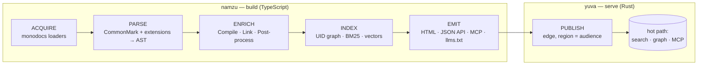

# Knowledge Platform — Engine Architecture

> The single canonical design for the engine that builds and serves `learn.cogitave.com`. We build it **from scratch to the DocFX spec** — Microsoft Learn dropped DocFX in November 2022 and runs a closed engine, so we author against the open spec and treat live Learn as a black box ([ADR-0004](../../standards/docs/decisions/0004-docs-engine-docfx-spec.md)). The format is the standard (portability + certification); the engine is ours.

## 1. Principles

1. **One model, many projections.** Every document is a discriminated, typed node in a single UID property graph. HTML, the JSON content API, MCP resources, and `llms.txt` are all *projections* of that one model — not separate pipelines.
2. **Build is decoupled from serve.** Authoring and compilation run in **namzu** (TypeScript); serving, search, and MCP run in **yuva** (Rust). The contract between them is the typed catalog + index artifacts, not shared code.
3. **Incremental by construction.** Identity is a content-addressed hash; a change rebuilds only the transitive closure of affected nodes, never the whole site.
4. **Schema-DSL validates *and* interprets.** A single schema per type drives validation, the editor, and the build interpretation — and is the certificate-level blocking gate.
5. **Agent-first surfaces.** The UID graph and every build intermediate are live MCP surfaces, so an agent queries the same knowledge a human reads.

## 2. The pipeline

The outward pipeline has six stages: **ACQUIRE → PARSE → ENRICH → INDEX → EMIT → PUBLISH**. The middle of that pipeline — turning raw files into a linked, post-processed model — mirrors the classic DocFX build, which runs **Compile → Link → Post-process** over a `DocumentBuilder` orchestrating per-type `DocumentProcessor`s and a shared host service.[^docfx-pipeline]



### ACQUIRE — monodocs aggregation

Content is pulled from multiple repositories and roots through **pluggable loaders** (a *monodocs* aggregation). Each `build.content` entry in [`docs.config.json`](../docs.config.json) names a loader (`learn-pr`, `achievements`, `diataxis`, …), a source glob, exclusions, and a destination catalog namespace. A loader's only job is to yield raw typed documents; adding a new content shape means adding a loader, not forking the engine. This is the `content`/`resource`/`exclude`/`dest` model of `docfx.json`, generalized.[^docfx-build]

### PARSE — typed documents + extension set

Line 1 of every document declares its type: `### YamlMime:Module | ModuleUnit | LearningPath | Achievements`. A single validator dispatches on that discriminator. Prose is a **CommonMark** superset parsed deterministically; CommonMark via a Markdig-class engine is exactly what DocFX standardizes on,[^docfx-md] but we do **not** fork Markdig — the extension set (alerts, includes, `:::code`, tabs, `:::image`, zone pivots, monikers, `<xref>`) is re-implemented in Rust so that build and serve share one deterministic grammar. The output of PARSE is a content-addressed **AST** per document.

### ENRICH — Compile → Link → Post-process

- **Compile (prebuild):** resolve includes and `:::code` snippet references, apply metadata precedence (front-matter > fileMetadata > globalMetadata), expand zone pivots and moniker ranges. Dependencies discovered here feed the incremental graph — DocFX likewise analyzes dependencies in a *prebuild* step so only changed files rebuild.[^docfx-pipeline]
- **Link:** resolve every `<xref:uid>` / `@uid` against the global UID graph, wire `Module.units[] → ModuleUnit`, `LearningPath.modules[] → Module`, and `badge`/`trophy → achievements`.
- **Post-process:** validate links, bookmarks, and HTML; run the blocking gate (§4). DocFX runs link/bookmark validation as configurable post-processors in the same position.[^docfx-pipeline]

### INDEX — graph, BM25, vectors

ENRICH's typed model is materialized three ways, mirroring Cogitave Core's substrate: a **UID property graph**, a **BM25** full-text index over immutable mergeable segments, and an **HNSW** vector index for semantic retrieval. The search core is a Tantivy-class Rust library — Tantivy is a Lucene-inspired, BM25, segment-based full-text engine with sub-10 ms startup, which is what makes embedded and edge search viable.[^tantivy]

### EMIT — one model, four targets

From the single typed model the engine emits, in parallel:

| Target | For | Shape |
| --- | --- | --- |
| **HTML** | humans | rendered site |
| **JSON content API** | tools / LMS | catalog + per-UID documents (Learn Catalog API analog) |
| **MCP** | agents | tools + resources over the UID graph |
| **llms.txt** | LLMs | curated link index + `llms-full.txt` |

### PUBLISH — edge-first

Artifacts publish to the edge; **region follows audience/locale**, and the cache key is `(uid, moniker, locale, audience)`. On change, the serve tier emits MCP `notifications/resources/updated` and `notifications/resources/list_changed` so subscribers refresh without polling.[^mcp-resources]

## 3. Incremental builds (content-addressed)

Every node carries two hashes: a **source hash** (raw bytes) and an **AST hash** (parsed, normalized tree). Hashes are keys in a **dependency graph** whose edges are the relationships discovered during ENRICH: `includeEdges`, `xrefEdges`, and `snippetEdges`. A rebuild:

1. Re-hashes changed sources.
2. Walks the dependency graph to the **transitive closure** of affected nodes (e.g., editing an `includes/*.md` invalidates the unit that includes it and any page that xrefs that unit).
3. Recompiles only that closure; everything else is served from cache.

This is the content-addressed, Merkle-style discipline that lets large sites skip full rebuilds — DocFX implements the same idea as incremental build keyed off a `manifest.json` of source/output paths, document types, and dependencies, rebuilding only changed files.[^docfx-pipeline] We make the *content hash* (not just the timestamp) the cache key, so a no-op edit is a no-op build. Cache and manifest locations are declared under `build.incremental` in [`docs.config.json`](../docs.config.json).

## 4. Schema-DSL and the blocking gate

The schema is a JSON-Schema superset that **validates and interprets**: keywords such as `contentType`, `reference`, `mergeType`, and `xrefProperties` tell the engine not only whether a field is valid but how to resolve and merge it. One schema per type is the single source from which the **TypeScript types, Rust types, and JSON Schema** are generated, so build and serve cannot drift.

The gate is **blocking at certificate level** — these are errors, not warnings, and they fail the build (`build.validation.failOn: error`):

- schema validation and required metadata (`title, uid, description` 75–300 chars, `type`, `owner`, `lastReviewed` ISO-8601, `products`, `roles`, `level`);
- broken `<xref:uid>` / link / bookmark;
- unresolved `:::code` snippet reference;
- knowledge-check shape (≥2 choices, exactly 1 correct in single-answer, every choice explained);
- unresolved `badge`/`trophy` or `units[]`/`modules[]` membership;
- missing image alt-text / complex-image long description.

This is the docs analog of DocFX's schema validation plus link/bookmark post-processors, hardened from warning to error for audit evidence.

## 5. Native MCP for docs

MCP is not a bolt-on adapter; **every build intermediate is a live MCP surface**. Resources are addressed by a stable URI template:

```
cogitave-docs://{product}/{version}/{uid}
```

The server supports `resources/list` and `resources/read`. It does **not** advertise change subscriptions: it reads a static build and cannot notice a change, so it emits no `listChanged`/`subscriptions/listen` stream (a target for a live-republishing deployment, not the static server).[^mcp-resources] Tools expose the retrieval and graph surface: `docs_search`, `docs_fetch`, `code_sample_search`, plus graph tools `get_related`, `get_learning_path`, and `resolve_xref`. The server prefers the **stateless** 2026-07-28 revision (`server/discover` as the entry point, the protocol version carried per-request in `_meta`) and also accepts the current handshake-based **2025-11-25**, so shipping clients connect today; the strict 2026-07-28 rules apply only to a request that declares that version.

## 6. Serve tier and edge-first search

The Rust hot path (`yuva`) is a single binary: BM25 over immutable mergeable segments + HNSW vectors + the property graph + the MCP server, with a graph-aware re-rank over moniker freshness, audience/region, and prerequisite proximity. For the browser, a **static, fragmented index** ships alongside the HTML so search runs client-side with no server round-trip — the Pagefind model, which splits the index into chunks and can full-text-search a 10,000-page site for under ~300 kB of total payload.[^pagefind] Large or authenticated corpora fall back to the server index; the cache key stays `(uid, moniker, locale, audience)`.

## 7. Content taxonomy (Diátaxis)

`type` is the single content taxonomy and maps to a **Diátaxis** mode — **tutorial, how-to, reference, explanation** — arranged on the acquisition-vs-application and practical-vs-theoretical axes.[^diataxis] Learn training content (Module/Unit/Path) sits on the practical/acquisition side; `docs/*.md` like this file are `explanation` or `reference`. The mapping is enforced by the metadata schema, not left to convention. See the [authoring guide](authoring-guide.md) for how authors choose a mode.

## 8. Open questions

- **Embedding model**: own vs spec'd (carried from the solution blueprint's strategic forks).
- **Hash function**: `blake3` is the current default for the AST hash; revisit if a content-defined chunking scheme is needed for very large single documents.

> [!NOTE]
> **Resolved — snippet registry.** Code-by-reference resolves against a **central registry** at `learn/snippets/` (`build.snippets` in [`docs.config.json`](../docs.config.json)), not a per-reference per-repo lookup. `:::code source` resolves from the content root and `id` selects a `// <id>…</id>` region; cross-repo sources are mounted into the registry by a loader. See the [authoring guide](authoring-guide.md#5-code-by-reference-code).

## Sources

[^docfx-pipeline]: DocFX document build pipeline (Compile/Link/Post-process; `DocumentBuilder`; prebuild dependency analysis; incremental build keyed off `manifest.json`). DeepWiki, *Document Build Pipeline · dotnet/docfx* — https://deepwiki.com/dotnet/docfx/8-document-build-pipeline
[^docfx-build]: DocFX `docfx.json` build content/resource/exclude/dest model and CLI. DocFX docs — https://dotnet.github.io/docfx/reference/docfx-cli-reference/docfx-build.html and repo https://github.com/dotnet/docfx
[^docfx-md]: DocFX Markdown engine — CommonMark via Markdig with default extensions. DocFX docs — https://dotnet.github.io/docfx/docs/markdown.html
[^tantivy]: Tantivy — Rust full-text search library inspired by Apache Lucene; BM25, segment-based immutable index, sub-10 ms startup. https://github.com/quickwit-oss/tantivy
[^pagefind]: Pagefind — static, fragmented search index that runs in the browser; ~300 kB total payload for a 10,000-page site. https://pagefind.app/
[^mcp-resources]: Model Context Protocol — Server Resources (`resources/list`, `read`, `templates/list`, `subscribe`; `notifications/resources/updated` and `list_changed`; `subscribe`/`listChanged` capabilities; URI schemes). MCP spec 2025-06-18 — https://modelcontextprotocol.io/specification/2025-06-18/server/resources
[^diataxis]: Diátaxis — four documentation modes (tutorials, how-to, reference, explanation) on two axes. https://diataxis.fr/
[^llmstxt]: llms.txt — proposal by Jeremy Howard (2024-09-03) for an `/llms.txt` index plus `llms-full.txt`. https://llmstxt.org/
